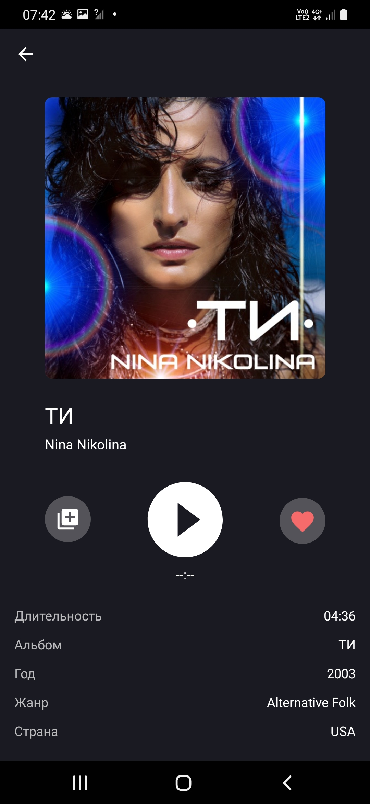
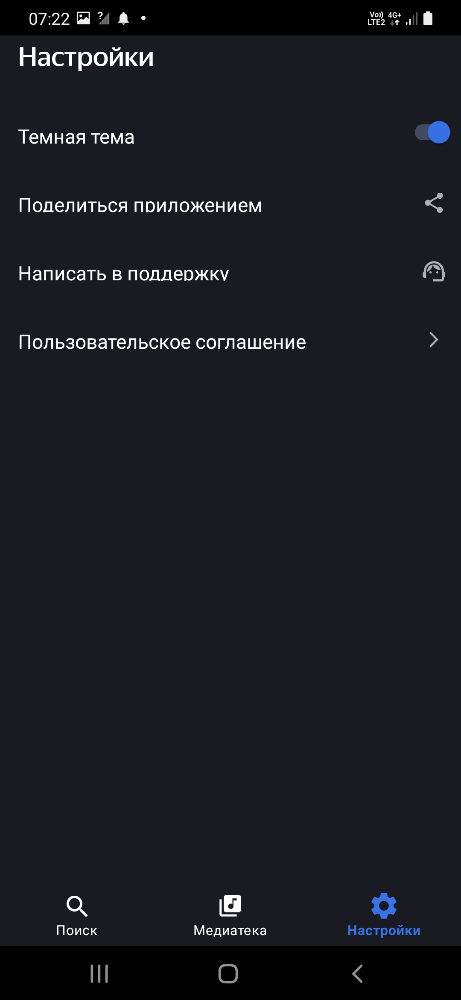

  
  
  
  

<h1 align="center">
  🎵 MusicFinder
</h1>

  <strong>Учебное Android-приложение для поиска и организации музыки с использованием iTunes API</strong>

  Современное приложение на Kotlin с Clean Architecture для поиска треков, создания плейлистов и управления музыкальной библиотекой

  <a href="#-о-проекте">О проекте</a> •
  <a href="#-функциональность">Функциональность</a> •
  <a href="#-технологический-стек">Технологии</a> •
  <a href="#-архитектура">Архитектура</a> •
  <a href="#-скриншоты">Скриншоты</a> •

---

## 📱 **О проекте**

**MusicFinder** — учебное Android-приложение, разработанное для демонстрации современных подходов к разработке на платформе Android. Приложение позволяет искать музыку через iTunes API, прослушивать 30-секундные превью треков, создавать собственные альбомы и управлять избранными композициями.

**Цель проекта**: Практическое освоение Clean Architecture, современных Android-библиотек и работы с REST API.

## ✨ **Функциональность**

### 🎯 **Основные возможности**
- **Поиск музыки**: Интеграция с iTunes Search API для поиска треков, альбомов и исполнителей
- **Прослушивание превью**: Воспроизведение 30-секундных образцов треков
- **Управление библиотекой**:
  - Добавление треков в "Избранное"
  - Создание пользовательских альбомов/плейлистов
  - Просмотр истории поиска
- **Персонализация**:
  - Переключение между светлой и темной темами
  - Локальное хранение пользовательских данных

### 📱 **Навигация**
Приложение использует Bottom Navigation с тремя основными разделами:
1. **Поиск** - основной экран для поиска музыки
2. **Библиотека** - избранные треки и пользовательские альбомы
3. **История** - последние поисковые запросы

## 🛠 **Технологический стек**

### **Языки и фреймворки**
- **Kotlin** - 100% Kotlin с использованием современных возможностей языка
- **Coroutines & Flow** - асинхронное программирование
- **Jetpack Compose** - современная декларативная UI-библиотека
- **Navigation Component** - навигация между экранами

### **Архитектурные компоненты**
- **Clean Architecture** - разделение на слои
- **MVVM** - Model-View-ViewModel для UI слоя
- **Repository Pattern** - абстракция доступа к данным
- **Dependency Injection** - Dagger Hilt или Koin

### **Библиотеки**
- **Retrofit 2** - HTTP-клиент для работы с API
- **Room Database** - локальное хранение данных
- **Coil** - загрузка и кэширование изображений
- **ExoPlayer** или **MediaPlayer** - воспроизведение аудио
- **DataStore** - хранение настроек (тема, предпочтения)

### **API**
- **iTunes Search API** - поиск музыкального контента
- **Ограничение**: только 30-секундные превью треков

## 🏗 **Архитектура**

Проект построен по принципам **Clean Architecture** с четким разделением на слои:

## 📸 **Скриншоты**

### **Основные экраны**
| | | |
|:---:|:---:|:---:|
| **Трек ** | **История поиска** | **Избранные треки** |
|  |  |  |
| **Плейлисты** | **Настройки (светлая тема)** | **Настройки (темная тема)** |
|  |  |  |

*Для просмотра в полном размере кликните на изображение*

🎯 Цели обучения
Этот проект демонстрирует:

Реализацию Clean Architecture в Android

Работу с REST API (Retrofit)

Локальное хранение данных (Room)

Современный UI с Jetpack Compose

Асинхронное программирование (Coroutines/Flow)

## 👨‍💻 **Контакты**
*   Автор: [Руслан Соловьев]
*   Email: [solovevrus1993@gmail.com]
*   GitHub: [https://github.com/RuslanSolovev]

Dependency Injection

Воспроизведение аудио
